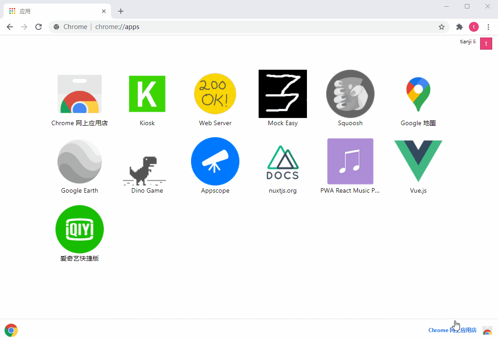
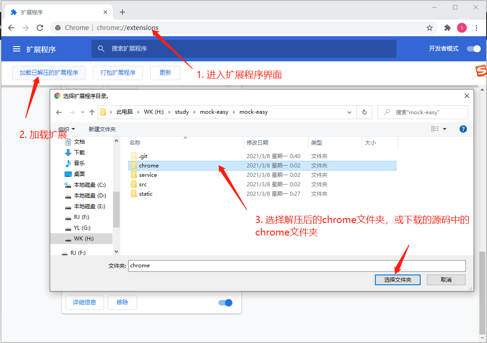

# Mock Easy


可在本地创建一个mock服务，将Easy Mock以chrome应用形式迁移到本地



# 特性
 - 可在本地创建mock服务，创建、修改界面与easymock一样
 - 可将easymock的上的项目导入到本地
 - 可以创建本地文件服务器

# 启动
```bash
  # 安装依赖
  npm run i
  # 本地环境启动
  npm run dev
```

# 安装到chrome
 - 下载[mock-easy.zip包](https://github.com/litianji/mock-easy/releases/tag/1.0.0)，并解压
 - 打开chrome, [打开扩展程序(chrome://extensions/)](chrome://extensions/)
 - 开启`开发者模式`，点击加载已解压的扩展程序，选择到项目目录下的chrome文件夹

